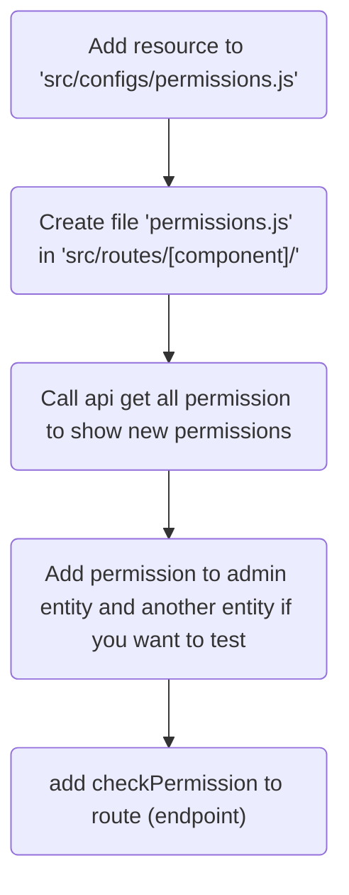

# Project Structure
This project is strured component oriented. Each component contains function files: endpoint.js, controller.js, service.js, model.js, ...

Take a look below diagram:
```
|- env (env files)
|- src (source code)
|   |- configs (configurations)
|   |- connections
|   |   |- mongodb (khai báo kết nối đến mongodb)
|   |   |- redis (khai báo kết nối đến redis)
|   |- libs (helper libs)
|   |   |- debug.js (debugger)
|   |   |- ...
|   |- resources (components)
|   |   |- user (user component)
|   |   |   |- service.js (user service)
|   |   |   |- model.js (interact to db)
|   |   |   |- schema-mg.js (define mongoose schema)
|   |   |   |- static.js (các hằng số)
|   |   |- ...
|   |- routes (components)
|   |   |- user (user component)
|   |   |   |- endpoint.js (routing file)
|   |   |   |- controller.js (handle request & response)
|   |   |   |- schema-api.js (define schema api, using for 
|   |- www (init www app)
|   |   |- app.js (app)
|   |   |- middleware.js (global middleware)
|   |   |- response-handler.js (cache error and handle response)
|   |   |- router.js (routing loader)validation request parameters)
|   |   |- ...
|   |- bootstrap.js
|   |- start.js
```

**Main workflow:**

*(Not recommended any differently workflow)*
```
Client request -> endpoint.js (routing) -> controller.js (handler) -> service.js -> model.js -> schema-mg.js
```

# Coding Rules
## APIs
Implements OpenAPI specification
- Each resources is represented by plural noun/phrase noun
```
Ex: 
/users (not /user)
/messages (not /message)
```
- Verbs: GET = read, POST = create, PUT = update, DELETE = delete
- Using parameter when interact a resource, which is specification by id
```
Ex:
POST /users to create user
GET /users/:id to get a user by id
PUT /users/:id to update a user by id
DELETE /users/:id to delete a user by id
...
```
## Another rules
### Prefix function
- get: using for getting resource


# Diagram
## Config new resource and permission

